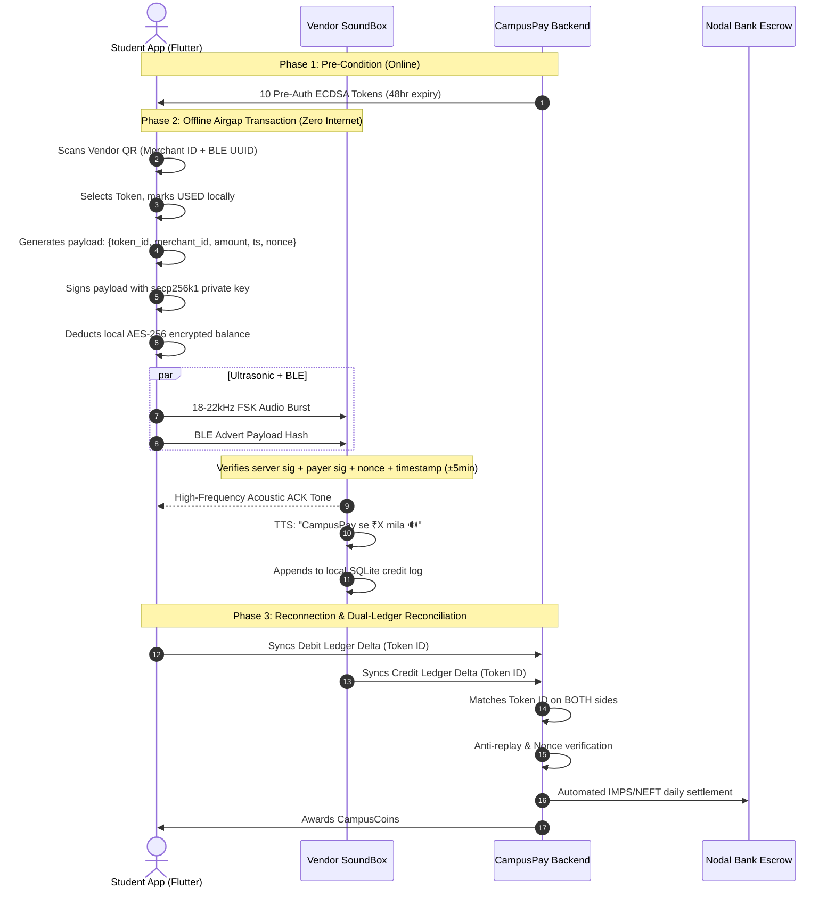

# CampusPay — Offline-First Campus Payment Architecture Blueprint
**Target Campus:** Don Bosco Institute of Technology (DBIT Mumbai)  
**Architecture Version:** v2.4 (Offline-First Multi-Carrier)  
**Visual Blueprint File:** [`campuspay_architecture_poster.html`](file:///Users/manyashah/StudioProjects/CampusPay/campuspay_architecture_poster.html)

---

## 1. Executive Summary & Design Philosophy
CampusPay is an offline-first payment network engineered specifically for DBIT Mumbai's campus ecosystem. In crowded spots like canteen basements, engineering labs, and auditorium corridors where 4G/5G signals decay, standard UPI QR payments experience frequent connection timeouts and packet drops.

CampusPay solves this with a **tri-tier payment rail**, where offline airgap mechanisms (Ultrasonic 18–22kHz FSK + Bluetooth Low Energy advertisement bursts) enable instant transactions without cellular or Wi-Fi connectivity, followed by guaranteed asynchronous dual-ledger reconciliation.

```
+-----------------------------------------------------------------------------------+
|                           CAMPUSPAY TRANSACTION MODES                             |
+---------------------+-------------------------------+-----------------------------+
| TIER 1: ONLINE UPI  | TIER 2: OFFLINE WALLET        | TIER 3: SILENT USSD         |
| Green Rails         | Yellow Rails                  | Purple Rails                |
| Internet Available  | Zero Internet / Pre-Auth      | Cellular Signal Only        |
| Razorpay SDK        | Ultrasonic + BLE Multi-Carrier| GSM *99# Telephony Session  |
| Real-time settlement| Dual-ledger deferred sync     | Bank-to-bank direct debit   |
+---------------------+-------------------------------+-----------------------------+
```

---

## 2. Interactive System Architecture Poster
We have built a dedicated fintech war-room style poster in [`campuspay_architecture_poster.html`](file:///Users/manyashah/StudioProjects/CampusPay/campuspay_architecture_poster.html).

### Key Features of the Poster:
1. **Color System**:
   - Background: Pure Black `#0A0A0A`
   - Primary Accent: Electric Yellow `#FFE500`
   - Secondary Accent: Deep Purple `#6B21A8`
   - Data & Storage: Pure White `#FFFFFF` on Dark Cards `#1A1A1A`
   - Settlements: Success Green `#22C55E`
   - Telemetry & Subtitles: Muted `#888888` / Monospace `#C084FC`
2. **Three Horizontal Layers**:
   - **Layer 1 — Client Devices**:
     - **Student App**: Phone silhouette with purple card accents (`mobile_scanner`, `sqflite + encrypt`, `flutter_secure_storage`, `pointycastle secp256k1`, `flutter_sound 18–22kHz`, `flutter_blue_plus`, `TelephonyManager`, `dio`, `razorpay_flutter`).
     - **Vendor SoundBox**: Rectangular silhouette with speaker grille, teal card accents, and yellow quote **"CampusPay se ₹X mila 🔊"**.
     - **Admin Panel**: Monitor/laptop outline in purple with white cards and yellow borders (`Merchant Onboarding`, `Identity Governance`, `Reconciliation Dashboard`, `IMPS/NEFT Payouts`, `CampusCoins`).
   - **Layer 2 — Communication Channels**:
     - Ultrasonic 18–22kHz FSK wave with acoustic ACK.
     - BLE advertisement fallback arc (triggers after 3s).
     - Silent USSD *99# GSM cellular path.
     - HTTPS REST asynchronous ledger sync.
     - **P2P Mini Flow**: Two-phase commit protocol with acoustic ACK for student-to-student transactions.
   - **Layer 3 — Backend Server**:
     - Node.js 20 LTS + Express on AWS EC2 / Railway.
     - 3x3 Module Grid: Wallet Engine, Token Signing Service, Sync Endpoint, Reconciliation Engine, Fraud Detection, Settlement Engine, CampusCoins Engine, JWT Auth, Admin API.
     - Database strip: MySQL 8.0 with Sequelize ORM (`users`, `wallets`, `tokens`, `transactions`, `soundbox_log`, `reconciliation_audit`, `merchants`, `campus_coins`, `p2p_transfers`, `sync_queue`) + Redis 7 cache.
3. **Interactive Capabilities**:
   - **Step-by-Step Lifecycle (① to ⑧)**: Click any step on the left timeline to illuminate the exact components involved in that phase.
   - **Filter Modes**: Toggle between All Layers, Offline Sound + BLE, P2P Engine, Silent USSD, and Security Audit.
   - **Simulate Flow**: Automated animation of the payment lifecycle across edge devices, airgap carriers, and backend cluster.
   - **Print / PDF Export**: Formatted for A2/A3 wall posters.

---

## 3. Cryptographic Proofs & Security Boundaries



### Security Invariants:
1. **AES-256 GCM**: Device balance encrypted at rest with Android Keystore / iOS Secure Enclave wrapping.
2. **ECDSA secp256k1**: Asymmetric signing ensures private keys never leave the student's device.
3. **UUID Nonces**: Every transaction carries an ephemeral UUID, preventing replay attacks.
4. **Single-Use Enactment**: Tokens are marked `USED` locally before the airgap wave emits.
5. **48-Hour Hard Expiry**: Stored offline tokens self-invalidate after 48 hours, forcing online check-in.
6. **Dual Ledger Parity**: Reconciliation requires the exact `token_id` in both the student debit log AND the SoundBox credit log.
7. **Silent USSD Safeguard**: TelephonyManager passes MPIN directly to the telco GSM session without saving or logging credentials.
